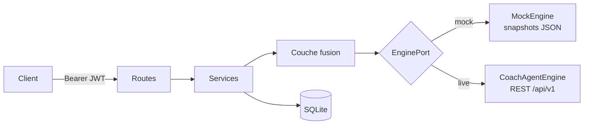

# Enduraw Form Tracker

API qui suit la **forme et la readiness** des athlètes d'endurance. La thèse :
les angles morts d'un athlète sont **subjectifs et localisés** (ce qu'il ressent,
où ça tire) ; on les fusionne avec un moteur **objectif** (CoachAgent : charge,
fitness, fatigue). Devise : *« ne demander à l'humain que ce que seul l'humain
peut savoir »*. Le signal phare n'est pas une métrique de plus mais la
**divergence subjectif ↔ objectif** — l'écart entre le ressenti et le mesuré.

L'app tourne **en standalone** (moteur simulé local) et peut **se brancher** sur
CoachAgent via REST. La sortie « blessure » est toujours une incitation à
*consulter un physio*, jamais un diagnostic.

## Stack

- Python 3.12 · FastAPI · Uvicorn
- SQLAlchemy 2.0 (typé `Mapped[...]`) · SQLite · Alembic
- Pydantic v2 · pydantic-settings
- python-jose (JWT) · bcrypt
- pytest · ruff · black · mypy · pre-commit

## Architecture

Les routes délèguent à des services ; la lecture de readiness vit dans la couche
**fusion** (`app/fusion/`), qui combine moteur objectif, métriques Garmin et
signaux subjectifs. Le moteur est abstrait derrière un `EnginePort` à deux
implémentations.



Détails et diagrammes de séquence : **[docs/architecture.md](docs/architecture.md)**.

## Démarrage rapide

En local (sans Docker) :

```bash
python -m venv .venv && source .venv/bin/activate
pip install -e ".[dev]"
cp .env.example .env
alembic upgrade head
uvicorn app.main:app --reload
```

Avec Docker (migrations appliquées au boot) :

```bash
cp .env.example .env
docker compose up --build
```

Vérifier puis explorer :

```bash
curl localhost:8000/api/health   # {"status":"ok","version":"0.1.0"}
```

Docs interactives : <http://localhost:8000/docs> et <http://localhost:8000/redoc>.

## Deux modes

Le moteur est choisi par `ENGINE_MODE` (voir `.env.example`) :

| Mode | Variable | Comportement |
| ---- | -------- | ------------ |
| **standalone** | `ENGINE_MODE=mock` | Lit des snapshots JSON par athlète depuis `MOCK_ENGINE_DIR` (défaut `./data/mock_engine`). La sync est un no-op. Aucune dépendance externe. |
| **live** | `ENGINE_MODE=live` | Appelle CoachAgent en REST. Requiert `COACHAGENT_BASE_URL` + `COACHAGENT_API_KEY` (`COACHAGENT_TIMEOUT_S=10.0`, `COACHAGENT_MAX_RETRIES=3`). Si `SYNC_ON_WRITE=true`, chaque écriture est repoussée vers CoachAgent en tâche de fond. |

## Démo

Peupler la base avec une cohorte synthétique déterministe (par seed), puis lire
les insights :

```bash
python -m scripts.seed --personas 5 --seed 42 --days 180 --reset
```

Cela génère 5 athlètes (presets `Regular`, `OverTrainer`, `PoorSleeper`,
`InjuryProne`, `Beginner`), écrit leurs données en base et les snapshots moteur
dans `MOCK_ENGINE_DIR`. Ensuite, créer un compte, récupérer un token, et lire la
readiness du jour :

```bash
TOKEN=$(curl -s localhost:8000/api/auth/register \
  -H 'content-type: application/json' \
  -d '{"email":"demo@enduraw.app","password":"demo-password"}' | jq -r .access_token)

curl -s localhost:8000/api/insights/today -H "Authorization: Bearer $TOKEN" | jq
```

> Les comptes synthétiques portent l'email `{persona}-{seed}@synth.enduraw`
> (ex. `regular-42@synth.enduraw`). Pour explorer leurs données seedées, branche
> un `MockEngine` sur le bon `user_id` ; pour un tour rapide de l'API, crée ton
> propre compte comme ci-dessus.

## Endpoints

Tous les endpoints métier exigent un en-tête `Authorization: Bearer <token>` et
sont strictement cantonnés à l'utilisateur authentifié. Une ressource
appartenant à un autre utilisateur renvoie `404` (son existence n'est jamais
divulguée). Contrat complet : **[docs/api-contract.md](docs/api-contract.md)** ;
schéma machine : [docs/openapi.json](docs/openapi.json).

**health / auth**

| Méthode | Chemin               | Description                     |
| ------- | -------------------- | ------------------------------- |
| GET     | `/api/health`        | Sonde de liveness               |
| POST    | `/api/auth/register` | Créer un compte (renvoie un token) |
| POST    | `/api/auth/login`    | Obtenir un token JWT bearer     |
| GET     | `/api/auth/me`       | Utilisateur courant (Bearer)    |

**checkin** — readiness quotidienne

| Méthode | Chemin                | Description                                        |
| ------- | --------------------- | -------------------------------------------------- |
| POST    | `/api/checkin`        | Upsert du checkin du jour (`201` create / `200` update) |
| GET     | `/api/checkin/today`  | Checkin du jour, ou `404`                          |
| GET     | `/api/checkin`        | Liste (`from`, `to`, `limit`, `offset`), du plus récent |

**niggles** — gênes persistantes + reports

| Méthode | Chemin                          | Description                                  |
| ------- | ------------------------------- | -------------------------------------------- |
| POST    | `/api/niggles`                  | Ouvrir un niggle (avec un premier report optionnel) |
| GET     | `/api/niggles`                  | Liste (`active=true` pour les ouverts), sans reports |
| GET     | `/api/niggles/{id}`             | Détail avec reports (date asc)               |
| PATCH   | `/api/niggles/{id}`             | MAJ `closed_at`/`structure`/`notes` (region/side immuables) |
| POST    | `/api/niggles/{id}/reports`     | Ajouter un report (`409` si le niggle est fermé) |

**mini-tests** — micro-tests neuromusculaires

| Méthode | Chemin                     | Description                                          |
| ------- | -------------------------- | ---------------------------------------------------- |
| POST    | `/api/mini-tests`          | Enregistrer un test `jump` ou `reaction` (`data` discriminé) |
| GET     | `/api/mini-tests`          | Liste (`type`, `from`, `to`, `limit`, `offset`)      |
| GET     | `/api/mini-tests/baseline` | Baseline glissante (mean/std + z le plus récent) par `type` |

**feedback** — RPE + affect post-séance

| Méthode | Chemin                   | Description                                  |
| ------- | ------------------------ | -------------------------------------------- |
| POST    | `/api/feedback/session`  | Upsert du feedback par `activity_id` (`source=app_manual`) |
| GET     | `/api/feedback/session`  | Liste (`activity_id`, `from`, `to`, pagination) |

**illness** — flags confirmés par l'athlète

| Méthode | Chemin               | Description                                    |
| ------- | -------------------- | ---------------------------------------------- |
| POST    | `/api/illness`       | Upsert du flag maladie du jour (`symptoms[]`)  |
| GET     | `/api/illness`       | Liste (`from`, `to`, `limit`, `offset`)        |
| GET     | `/api/illness/hint`  | Watch-hint (HRV↓ + RHR↑ + resp↑ vs baseline) pour un jour |

**garmin** — ingestion (simulée) des métriques montre

| Méthode | Chemin               | Description                                    |
| ------- | -------------------- | ---------------------------------------------- |
| POST    | `/api/garmin/ingest` | Ingestion batch de métriques quotidiennes + RPE montre |
| GET     | `/api/garmin/daily`  | Liste des métriques quotidiennes (`from`, `to`, pagination) |

**insights** — la readiness fusionnée (`app/fusion/`)

| Méthode | Chemin                       | Description                                          |
| ------- | ---------------------------- | ---------------------------------------------------- |
| GET     | `/api/insights/today`        | Readiness du jour : signaux, score composite, recommandation |
| GET     | `/api/insights/timeseries`   | Moteur + forme subjective + divergence Δ (`from`, `to`, `metrics`) |
| GET     | `/api/insights/correlations` | Synthèse niggle×charge sur une fenêtre (`from`, `to`) |

Le signal phare est la **divergence subjectif↔objectif** (ressenti vs mesuré).
La sortie blessure est toujours une incitation à *consulter un physio*, jamais
un diagnostic.

**sync** — repousser le subjectif de l'app vers le moteur (`app/services/sync_service.py`)

| Méthode | Chemin                  | Description                                          |
| ------- | ----------------------- | ---------------------------------------------------- |
| POST    | `/api/sync/coachagent`  | Flush des checkins + feedback non synchronisés (compteurs) |

Write-only (l'app est la source de vérité des signaux subjectifs + niggles). Le
wellness quotidien porte un compteur `active_niggles` plutôt que de pousser les
niggles un par un. En mode `live` les écritures se synchronisent aussi en tâche
de fond ; en standalone le push est un no-op qui préserve le backlog
(`SYNC_ON_WRITE`).

## Tests & qualité

```bash
pytest -v
ruff check .
black --check .
mypy app/
```

## Structure du projet

```
app/
├── main.py            # create_app() : 10 routers, CORS, lifespan
├── config.py          # Settings (pydantic-settings) — 14 champs
├── db.py              # Base, engine, SessionLocal
├── security.py        # bcrypt direct + JWT (python-jose)
├── auth/              # register / login / me, dépendances Bearer
├── models/            # 8 tables ORM + enums.py (str_enum → VARCHAR)
├── schemas/           # I/O Pydantic v2 par domaine
├── routes/            # checkin, niggles, mini_tests, feedback, illness,
│                      #   garmin, insights, sync, health, auth
├── services/          # sync_service, illness_service, checkin/feedback
├── engines/           # EnginePort, MockEngine, CoachAgentEngine, factory
├── fusion/            # signals, rules (pures), readiness, baselines, service
└── synth/             # générateur déterministe + personas + seeder
scripts/               # seed.py (cohorte synth), export_openapi.py
docs/                  # architecture, contrat API, modèle de données, ADRs
```

Documentation détaillée :

- [docs/architecture.md](docs/architecture.md) — design, couche fusion, diagrammes
- [docs/api-contract.md](docs/api-contract.md) — contrat CoachAgent + routes
- [docs/data-model.md](docs/data-model.md) — 8 tables, enums, contraintes, cascade
- [docs/synthetic-data.md](docs/synthetic-data.md) — le générateur déterministe
- [docs/decisions/](docs/decisions/) — ADRs (décisions d'architecture)

## Roadmap

- [x] **Step 1** — Squelette backend : Docker, health, auth JWT, modèle `User`, outillage & CI
- [x] **Step 2** — Modèles de domaine (checkin, niggle, mini_test, daily_metric…)
- [x] **Step 3** — Routes métier (checkin, niggles, mini-tests, feedback, illness)
- [x] **Step 4** — Générateur de données synthétiques (`app/synth/`) : histoires déterministes par seed
- [x] **Step 5** — Personas & seeding de démo (`app/synth/seeder.py`, `scripts/seed.py`)
- [x] **Step 6** — Couche moteur (`app/engines/`) : `EnginePort`, `MockEngine`, `CoachAgentEngine` + factory
- [x] **Step 7** — Fusion des signaux (`app/fusion/`) : règles → readiness, `/api/insights/*`
- [x] **Step 8** — Sync write-only (`app/services/sync_service.py`) : app → CoachAgent, `/api/sync/coachagent`
- [x] **Step 9** — Documentation du repo (livrable 2)

## Licence

MIT — voir [LICENSE](./LICENSE).
