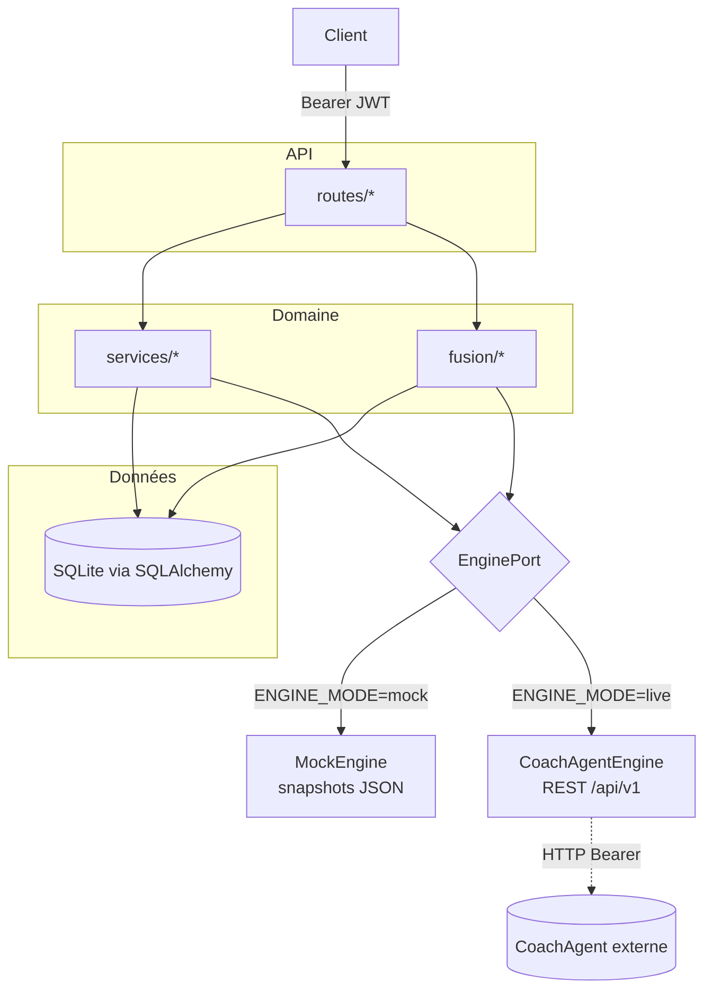
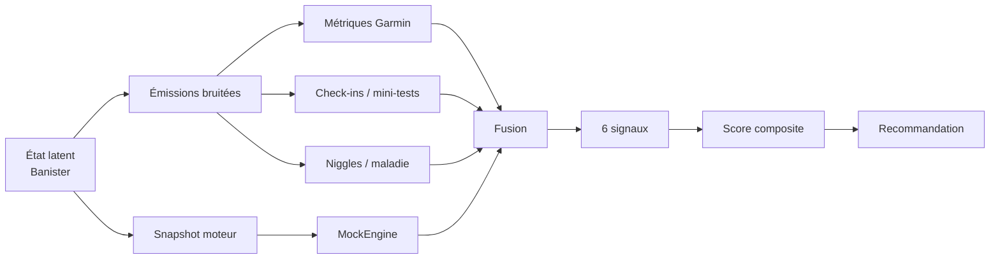
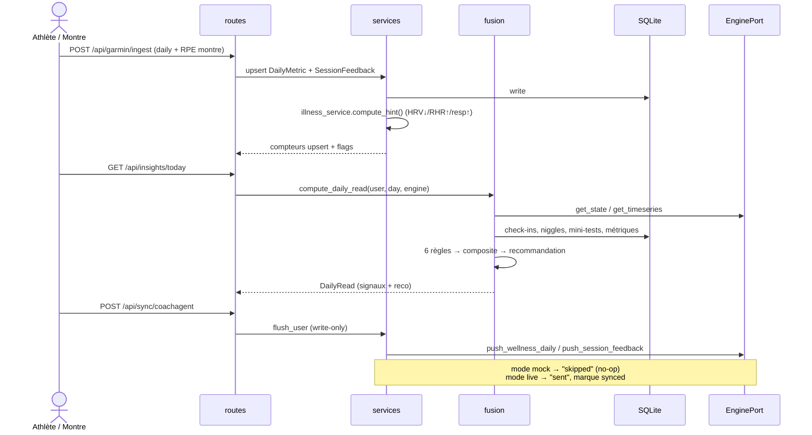

# Architecture

## Vue d'ensemble

Enduraw Form Tracker est une application **full-stack standalone** : elle tourne
sans dépendance externe (SQLite + moteur simulé), et accepte un **connecteur
optionnel** vers le moteur objectif CoachAgent. Trois principes structurent le
code :

1. **Les routes sont minces.** Elles valident l'entrée (Pydantic), résolvent
   l'utilisateur courant (Bearer JWT), et délèguent à un service. Pas de logique
   métier dans les routes.
2. **La readiness est une lecture, pas un état.** Elle est recalculée à la
   demande par la couche fusion à partir des données brutes — jamais persistée
   (voir [ADR DailyRead stateless](decisions/0008-dailyread-stateless.md)).
3. **Le moteur objectif est abstrait** derrière un `EnginePort`, ce qui permet
   de basculer entre simulation locale et CoachAgent réel sans toucher au reste.

## La couche fusion

`app/fusion/` est le cerveau de readiness. Sa séparation est volontaire et
stricte (voir [ADR fusion rule-based](decisions/0007-fusion-rule-based.md)) :

| Module | Rôle | IO ? |
| ------ | ---- | ---- |
| `service.py` | Orchestration : lit la base + le moteur, assemble les entrées, appelle les règles. | **Oui** — seul point d'IO. |
| `rules.py` | Les 6 règles, en **fonctions pures** : reçoivent des valeurs déjà chargées, renvoient un `Signal`. | Non (aucune DB, aucun moteur, aucune horloge). |
| `readiness.py` | Score composite (moyenne pondérée des sévérités) + recommandation (`train_as_planned` / `lighten` / `rest` / `consult_physio`). | Non. |
| `baselines.py` | z-scores glissants, ACWR — **les mêmes formules que le générateur synth**. | Non. |
| `thresholds.py` | Toutes les constantes (seuils, fenêtres, poids). | Non. |

Cette séparation rend les règles **testables sans base ni réseau** et garantit
que la logique de décision est explicable : chaque `Signal` porte sa sévérité,
ses valeurs de référence et une explication lisible.

Les 6 règles : divergence subjectif↔objectif, escalade de niggle, corrélation
niggle×charge, divergence wellness (HRV/sommeil/RHR), tendance des mini-tests,
et watch-hint maladie. Le détail des seuils est dans
[docs/synthetic-data.md](synthetic-data.md) et `app/fusion/thresholds.py`.

## Modèle latent → émissions

Le générateur synthétique (`app/synth/`) ne fabrique pas des nombres au hasard :
il simule un **état latent** physiologique (modèle de Banister : fitness,
fatigue, forme) puis **émet des observations bruitées** par-dessus — métriques
Garmin, check-ins subjectifs, mini-tests, niggles, épisodes de maladie. C'est ce
qui rend les divergences réalistes : un athlète « optimiste » émet des check-ins
au-dessus de sa forme latente.

Le `MockEngine` rejoue un **snapshot** dérivé de ce même latent (fitness,
fatigue, forme, charge, ACWR), de sorte que le moteur objectif et les
observations subjectives proviennent d'une vérité terrain commune mais ne se
voient pas l'un l'autre — exactement le scénario que la fusion doit démêler.

## EnginePort à deux modes

Un seul `Protocol` (`app/engines/port.py`) définit le contrat moteur (lectures
`get_state` / `get_timeseries` / `get_activities`, écritures
`push_wellness_daily` / `push_session_feedback`). Deux implémentations :

- **`MockEngine`** — lit un snapshot JSON par utilisateur depuis
  `MOCK_ENGINE_DIR`, calcule les agrégats (charge 7j/28j, tendance de forme) à la
  volée. Les écritures renvoient `"skipped"`.
- **`CoachAgentEngine`** — client HTTP async (httpx) vers `/api/v1`, auth Bearer,
  retries exponentiels sur 5xx/timeout. Les écritures renvoient `"sent"`.

Le choix se fait dans `factory.get_engine(user, settings)` selon `ENGINE_MODE`.
Voir [ADR EnginePort 2-modes](decisions/0004-engineport-two-modes.md) et le
[contrat CoachAgent](api-contract.md).

## Séquence : ingestion → fusion → sync

## Frontend (à venir)

Ce dépôt est **l'API backend uniquement**. Le client (interface athlète) n'est
pas encore implémenté ici. L'intention — écrans de check-in rapide, vue
readiness/divergence, saisie de niggles — et le choix de techno (p. ex. PWA
mobile) seront décrits dans le document de démarche, puis adossés à un ADR
lorsque le code existera. Cette section est un emplacement réservé pour ce
descriptif.
