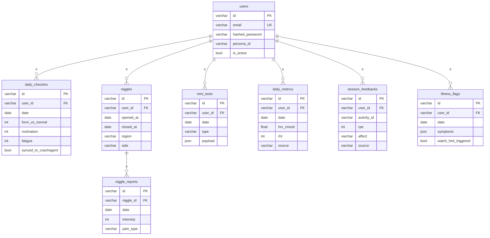

# Modèle de données

8 tables ORM (SQLAlchemy 2.0, typage `Mapped[...]`), une par concept du domaine.
Toutes les clés primaires sont des UUID v4 stockés en `VARCHAR(36)`. Les
horodatages `created_at` / `updated_at` viennent d'un `TimestampMixin`
(`DateTime(timezone=True)`, `updated_at` avec `onupdate`).

## Tables

| Table | Rôle | Contraintes notables |
| ----- | ---- | -------------------- |
| `users` | Comptes. | `email` UNIQUE + indexé ; `hashed_password` (bcrypt) ; `persona_id` optionnel. |
| `daily_checkins` | Readiness subjective du jour. | UNIQUE `(user_id, date)` ; CHECK `form_vs_normal ∈ [-2,2]`, `motivation ∈ [1,5]`, `fatigue ∈ [1,5]` ; champs `synced_to_coachagent`/`synced_at`. |
| `niggles` | Gênes persistantes (ouverture/fermeture). | `region`/`side` (enums) ; `opened_at`, `closed_at`. |
| `niggle_reports` | Trajectoire d'un niggle (reports datés). | CHECK `intensity ∈ [0,10]` ; `pain_type`/`mechanical_pattern`/`timing` (enums, nullables). |
| `mini_tests` | Micro-tests neuromusculaires. | `type` (enum) ; `payload` JSON (forme dépend du type). |
| `daily_metrics` | Métriques Garmin quotidiennes. | UNIQUE `(user_id, date)` ; `source` (défaut `garmin_faked`) ; nombreux champs nullables (HRV, RHR, sommeil…). |
| `session_feedbacks` | RPE + affect post-séance. | UNIQUE `(user_id, activity_id)` ; CHECK `rpe ∈ [1,10]` ; `affect`/`source` (enums) ; champs `synced_*`. |
| `illness_flags` | Flags maladie confirmés. | UNIQUE `(user_id, date)` ; `symptoms` JSON (liste) ; `watch_hint_triggered`, `confirmed_by_user`. |

### Index

Chaque FK `user_id` est indexée. En plus, des index composites **avec colonne de
date en DESC** servent les listes « du plus récent » sans tri à la lecture :
`ix_daily_checkins_user_id_date`, `ix_niggles_user_id_opened_at`,
`ix_niggle_reports_niggle_id_date`, `ix_mini_tests_user_id_type_date`,
`ix_daily_metrics_user_id_date`, `ix_session_feedbacks_user_id_reported_at`,
`ix_illness_flags_user_id_date`.

## Enums

Les 10 enums (`app/models/enums.py`) sous-classent `(str, Enum)` et sont
**stockés en `VARCHAR`** via le helper `str_enum()` — jamais en type `ENUM`
natif. `str_enum` produit un `sa.Enum(..., native_enum=False)`, qui se matérialise
en `VARCHAR` + contrainte `CHECK` sur l'ensemble des valeurs. Cela garde SQLite et
PostgreSQL identiques et rend l'ajout d'une valeur indolore (voir
[ADR enums VARCHAR](decisions/0009-enums-varchar.md)).

| Enum | Valeurs | Utilisé dans |
| ---- | ------- | ------------ |
| `BodyRegion` | foot_fore, foot_mid, foot_heel, ankle, achilles, calf, shin, knee_anterior, knee_medial, knee_lateral, knee_posterior, quad, hamstring, adductor, it_band, hip_flexor, glute, groin, lower_back, upper_back, neck, shoulder, other | `niggles.region` |
| `Side` | left, right, center, bilateral | `niggles.side` |
| `PainType` | sharp, dull, tension, burning, stabbing | `niggle_reports.pain_type` |
| `MechanicalPattern` | uphill, downhill, push_off, impact, rest, constant | `niggle_reports.mechanical_pattern` |
| `Timing` | during, after, morning_stiffness, constant | `niggle_reports.timing` |
| `Affect` | weak, neutral, strong | `session_feedbacks.affect` |
| `MiniTestType` | jump, reaction | `mini_tests.type` |
| `HrvStatus` | low, normal, high | `daily_metrics.hrv_status` |
| `IllnessSymptom` | sore_throat, congestion, fever, unusual_fatigue, cough, body_aches | `illness_flags.symptoms` (liste JSON) |
| `FeedbackSource` | garmin_watch, app_manual | `session_feedbacks.source` |

## Stratégie de cascade

Deux mécanismes complémentaires :

1. **Côté ORM** : `Niggle.reports` déclare `cascade="all, delete-orphan"` +
   `passive_deletes=True` — supprimer un niggle (via la session) supprime ses
   reports.
2. **Côté DB** : toutes les FK `user_id` (et `niggle_reports.niggle_id`) déclarent
   `ondelete="CASCADE"`. Supprimer un utilisateur emporte donc l'ensemble de ses
   lignes.

> ⚠️ **Note SQLite.** L'application des `ON DELETE CASCADE` au niveau base exige
> `PRAGMA foreign_keys = ON` par connexion. `app/db.py` ne pose pas ce PRAGMA
> aujourd'hui (`create_engine` n'ajoute que `check_same_thread=False` pour
> SQLite). Concrètement : sous SQLite, la cascade ORM Niggle→reports fonctionne
> (gérée par la session), mais la cascade DB déclenchée par une suppression
> brute d'utilisateur n'est pas garantie tant que le PRAGMA n'est pas activé. Les
> contraintes `ondelete` restent correctes et seront honorées sous PostgreSQL.

## Diagramme entité-relation

